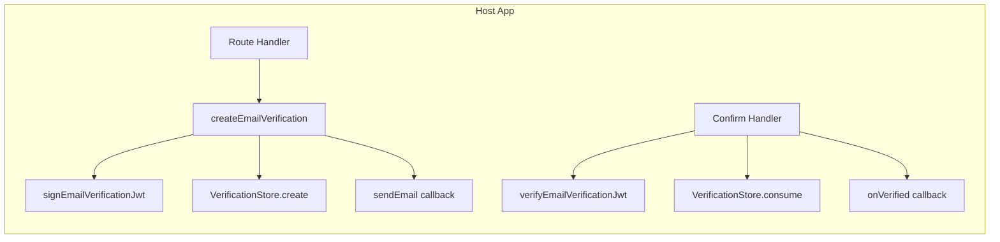

# Email Verification Module

## Overview

Portable email verification flow. One JWT per email, one-time store keyed by `jti`, provider-agnostic email delivery. Designed for monolith-first deployment with microservice-friendly boundaries.

## Requirements

### R1: Token Format

The system MUST issue email verification tokens as JWS Compact Serialization signed with Ed25519.

#### Scenario: Token structure
- GIVEN a signing key and claims
- WHEN a token is signed
- THEN the protected header MUST contain `alg: "Ed25519"`, `typ: "KUSALA-EMAIL-VERIFY+JWT"`, and `kid`
- THEN the payload MUST contain `iss`, `aud: "email-verify"`, `sub`, `email`, `jti`, `iat`, `exp`, `purpose: "email_verification"`
- THEN the token MUST be verifiable with the corresponding public key

#### Scenario: Token verification
- GIVEN a valid signed token
- WHEN the token is verified with matching expected issuer/audience/typ
- THEN the original claims are returned
- WHEN verified with wrong issuer THEN an error is raised
- WHEN the token is expired THEN verification fails
- WHEN `typ` does not match THEN verification fails

### R2: One-Time Store

The system MUST prevent replay attacks using a one-time store keyed by `jti`.

#### Scenario: Create and consume
- GIVEN a new jti
- WHEN `create()` is called THEN the record is stored
- WHEN `consume()` is called with the same jti THEN it succeeds
- WHEN `consume()` is called again THEN it returns `already_used`

#### Scenario: Expiration
- GIVEN a stored record past its `expires_at`
- WHEN `consume()` is called THEN it returns `expired`

### R3: Email Delivery

The system MUST delegate email sending to a pluggable provider.

#### Scenario: Provider interface
- GIVEN a message with `to`, `from`, `subject`, `text`/`html`
- WHEN `send()` is called on the provider
- THEN the provider dispatches the message
- THEN `{ provider, messageId? }` is returned

### R4: Library API

The library MUST expose a single `createEmailVerification()` factory function.

#### Scenario: Factory setup
- GIVEN a config with `signingKey`, `verificationKey`, `kid`, `issuer`, `store`, `sendEmail`, `baseUrl`
- WHEN `createEmailVerification(config)` is called
- THEN it returns an object with `send` and `confirm` HTTP handlers

#### Scenario: Express integration
- GIVEN an Express app and a configured verification instance
- WHEN `app.post('/verify', verify.send)` is registered
- THEN POST requests with `{ userId, email }` sign a JWT, store it, send an email, and respond
- WHEN `app.get('/verify/confirm', verify.confirm)` is registered
- THEN GET requests with `?token=` verify the token and mark it consumed

#### Scenario: Next.js App Router integration
- GIVEN a Next.js route handler and a configured verification instance
- WHEN `export const POST = verify.sendWeb` is used
- THEN POST requests are handled correctly
- WHEN `export const GET = verify.confirmWeb` is used
- THEN GET requests are handled correctly

### R5: Minimal Boilerplate

The library MUST keep the integration surface minimal — all orchestration lives inside the library.

#### Scenario: Host app setup
- GIVEN a host application
- WHEN integrating email verification
- THEN the host only provides: keys, store (or connectionString), email-sending function, baseUrl
- THEN the host does NOT manually sign JWTs, manage stores, or construct emails

### R6: Self-Bootstrapping Schema

The Postgres store MUST auto-create the verification table if `autoMigrate` is enabled (default).

#### Scenario: Auto-migrate on connect
- GIVEN a `PostgresVerificationStore` with `autoMigrate: true` (default)
- WHEN `create()` is called for the first time
- THEN the table `email_verification_tokens` and its indexes exist before the row is inserted
- WHEN the table already exists THEN the migration is a no-op

#### Scenario: Shorthand connectionString
- GIVEN a config with `connectionString` instead of `store`
- WHEN `createEmailVerification(config)` is called
- THEN a `PostgresVerificationStore` is created internally with autoMigrate

#### Scenario: Existing pool
- GIVEN a config with `pool` (existing pg.Pool) instead of `store` or `connectionString`
- WHEN `createEmailVerification(config)` is called
- THEN the store shares the same pool — no extra connection

### R7: Exported DDL for ORM Integration

The library MUST export the DDL so host apps can include it in their own migration files.

#### Scenario: SCHEMA_SQL export
- GIVEN a host app using Prisma / TypeORM / Sequelize / Knex
- WHEN the host creates a migration
- THEN it can import `SCHEMA_SQL` from the package and include it in the migration
- THEN the host can disable `autoMigrate` to avoid double-migration

## Architecture



## Interfaces

```typescript
type Config = {
  signingKey:       CryptoKey        // Ed25519 private key
  verificationKey:  CryptoKey        // Ed25519 public key
  kid:              string
  issuer:           string
  ttlSeconds?:      number           // default 1800
  store?:           VerificationStore
  connectionString?: string          // shorthand — creates PostgresVerificationStore internally
  pool?:            pg.Pool          // existing pool — shares host app's DB connection
  sendEmail:        (params: { to: string; link: string }) => Promise<void>
  onVerified?:      (params: { userId: string; email: string }) => Promise<void>
  baseUrl:          string
  confirmPath?:     string           // default '/verify/confirm'
}

type EmailVerificationAPI = {
  send:         express.RequestHandler
  confirm:      express.RequestHandler
  sendWeb:      (req: Request) => Promise<Response>
  confirmWeb:   (req: Request) => Promise<Response>
}

// Additional exports for ORM integration
export const SCHEMA_SQL: string        // DDL for email_verification_tokens
export function ddl(tableName: string): string  // Parameterized DDL
export { PostgresVerificationStore }
// PostgresStoreConfig now accepts: connectionString | pool
```
